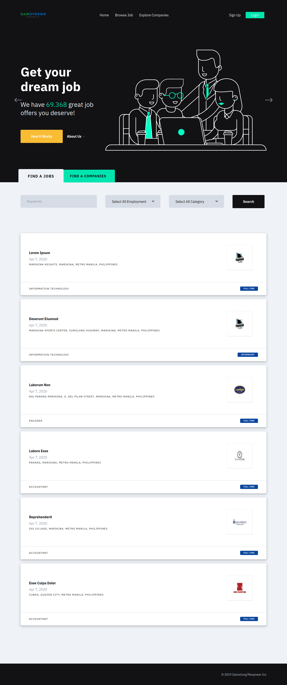
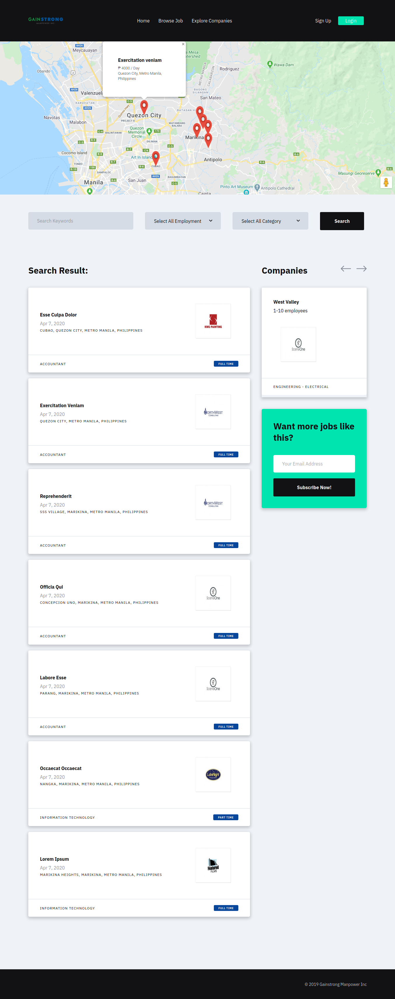
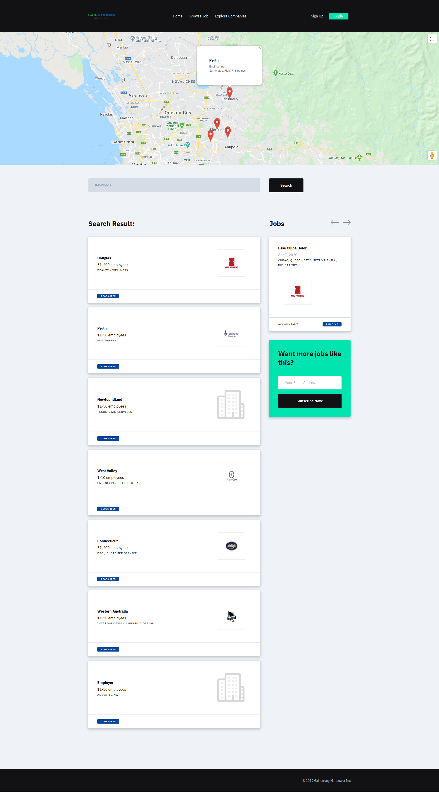
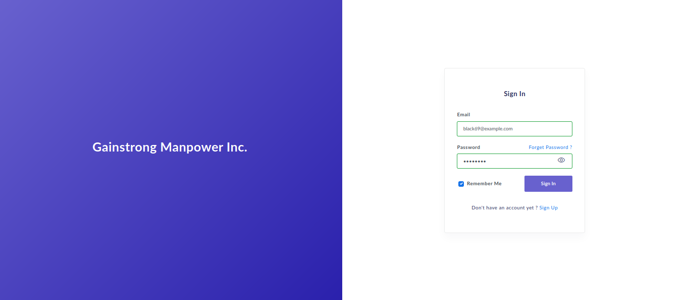
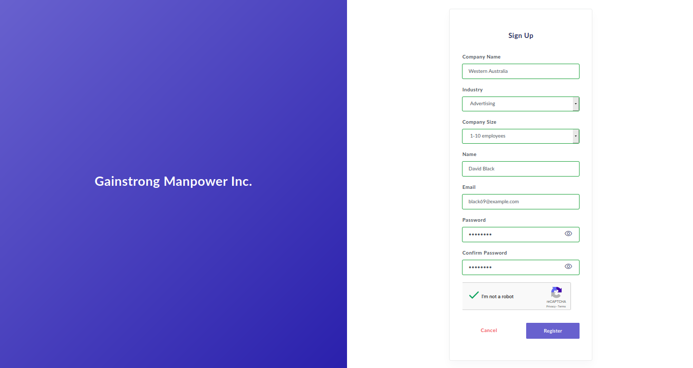

## Laravel 5.8

### Home Page

### Browse Jobs

### Browse Companies

### Sign In Page

### Sign Up Page

## Demo

You can try the live demo : www.gainstrongm.xyz

You can check the Prototype here: https://github.com/lysianor/jobadvertisement/tree/master/Prototype

## How to use

- Clone the repository with __git clone__
- Copy __.env.example__ file to __.env__ and edit database credentials there
- Insert your GOOGLE_RECAPTCHA_KEY RECAPATCHA v2
- Insert your GOOGLE_MAPS_API_KEY
- Insert your Smtp key
- Run __composer install__
- Run __php artisan key:generate__
- Run __php artisan migrate --seed__ (it has some seeded data for your testing)
- That's it: launch the main URL. 
- You can login to adminpanel by going go `/login` URL and login with credentials __admin@admin.com__ - __password__
